## TL;DR;

I developed a 3D game engine in C++ using OpenGL from scratch, relying minimally on third-party libraries, and released a small game prototype built with it. The prototype, a simple 3D asteroids game, is available for download on [itch.io](https://flexww.itch.io/space-shooter). I want to share my journey, insights, and the engine's architecture.

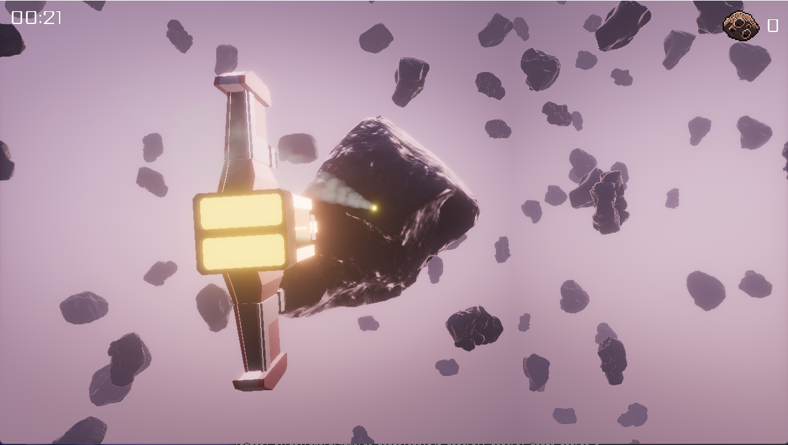

## Table Of Contents

- [Motivation](#motivation)
- [General](#general)
    - [Know What You Want To Build](#know-what-you-want-to-build)
    - [Do Not Think (Too Much) About Architecture](#do-not-think-too-much-about-architecture)
- [Engine Core](#engine-core)
    - [Build System](#build-system)
    - [Memory Management](#memory-management)
    - [Virtual File System](#virtual-file-system)
    - [Config System](#config-system)
- [Graphics](#graphics)
    - [Frame Breakdown](#frame-breakdown)
        - [GBuffer](#gbuffer)
        - [Lighting](#lighting)
        - [Transparent](#transparent)
        - [Bloom](#bloom)
        - [Tone Mapping](#tone-mapping)
        - [UI, Debug](#ui-debug)
    - [Renderer Interface](#renderer-interface)
    - [Material System](#material-system)
- [Game UI](#game-ui)
- [Asset Management](#asset-management)
- [Audio](#audio)
- [Physics](#physics)
- [ECS](#ecs)
- [Deployment](#deployment)
- [Final Words](#final-words)
- [Resources](#resources)


## Motivation

Building things and understanding how they work under the hood has always captivated me. From the moment I began programming, the ability to create my own worlds through a computer fascinated me. Writing my own game with my own game engine has been a longstanding passion. The project I'm describing here began in November 2023 as a hobby alongside my full-time job as a Software Engineer. However, this wasn't a project I started from scratch. I had spent years coding games and game engines as a hobby, and I've included some screenshots of earlier projects at the end of this article.

For this project, I aimed to avoid third-party libraries whenever possible, purely for the fun of it. The only exceptions are for physics (I attempted to create my own but found it too time-consuming), audio, and some file parsing tasks like PNG, JPEG, and TTF.

The goal of this project is to enable the creation of small indie games for game jams.

## General

Creating a 3D game engine from scratch is a significant undertaking. I'd like to share some tips for tackling a large project like this on your own. These tips apply not only to game engines but also to other large solo programming projects.

Below is a printout from cloc (Count Lines of Code) for my engine, excluding third-party code.

```txt
-----------------------------------------------------------------
Language       files          blank        comment           code
-----------------------------------------------------------------
C++               70           6476           1134          36015
C/C++ Header      68           1912            450           6037
CMake              7             20              1            226
-----------------------------------------------------------------
SUM:             145           8408           1585          42278
-----------------------------------------------------------------
```

### Know What You Want To Build

It may sound obvious, but my first attempts at building a game engine and game from scratch failed for several reasons. One of the most important reasons was the lack of a clear goal. Initially, I tried to build a general-purpose game engine without having an actual use case (game) in mind. This approach led to several problems.

First, I got lost in feature creep because I didn't have a clear objective. Game engines have no inherent meaning without the games created with them. As a beginner, I looked at large, general-purpose engines like Unreal Engine and Unity, thinking that this was how a game engine had to look and work. This assumption was incorrect.

Instead of trying to build a general-purpose engine, focus on creating a very specific (and simple) game without worrying too much about how you structure your code. Otherwise, you'll waste time on features you never need and that likely won't work well. Building a game provides confidence that what you're building actually works and is useful. It gives you a measurable success metric and helps maintain your motivation.

In my first attempts, I spent weeks building an editor, but it wasn't even possible to deploy a game with the engine! Naturally, the editor had many flaws because I didn't have anything to prove its usefulness. At the beginning, write down what you want to achieve. Cut every unnecessary feature and be clear about which features you don't want. You don't need every feature other games and engines have to create a good experience for the user. Working with limitations can foster creativity.

### Do Not Think (Too Much) About Architecture

When I began my game development journey, I was heavily influenced by Object-Oriented Programming (OOP) and its associated design patterns and best practices. Naturally, I sought out patterns and best practices for game engine development. However, I ended up wasting a lot of time trying to fit my code into these design patterns and SOLID principles. This often led to a point where my project became very difficult to modify, and my progress slowed significantly. Sometimes, I wouldn't make progress for weeks because I felt compelled to refactor my engine to adhere to a specific design pattern. What a waste of time!

Fortunately, I eventually discovered a different approach that made it easier to design applications: procedural programming. My current engine is a simple, old-school C++ codebase without any classes, virtual functions, constructors, destructors, or templates. To be clear, I'm not against OOP, but it didn't work well for this kind of project.

Transitioning from an object-oriented mindset to a procedural one was challenging. When I thought about features in my code, I always imagined objects and looked for ways to let them communicate via methods. What helped me overcome this was focusing on the pure algorithms and the inputs and outputs I wanted from a feature. I now usually start by implementing a function with input arguments and some output. Later, when I see that I need to group some parameters for convenience, I pack them together in a struct. When I find that I need some code in several places, I extract a function from it and make it available for reuse.

I believe this technique is what is referred to as [semantic compression](https://caseymuratori.com/blog_0015). My entire engine evolved from this approach, and I'm very satisfied with it. This method also allows me to make quick changes, and the abstractions I build along the way are generally useful, unlike the abstractions I created with my OOP mindset. This approach might not work for everyone or every team, but as a solo developer, it worked very well for me. Refactoring now mostly consists of moving some functions around or grouping parameters together in structs.

## Engine Core

In this section I want to walk you through the core systems I built in my engine that support all other systems like graphics, audio and physics.

### Build System

I use [CMake](https://cmake.org/) as my (meta) build system. CMake is an open-source, cross-platform tool designed to manage the build process of software using a compiler-independent method. It allows you to specify the files to be compiled and how they should be compiled together using text files called CMakeLists.txt. From these definitions, CMake generates build files for various build systems, such as Visual Studio, GNU Makefiles, and Ninja. CMake is a standard tool in the C++ community and, in my opinion, it performs the job exceptionally well. Its widespread use also makes it easier to integrate with other C++ projects.

My engine runs on both Linux and Windows. Building for multiple platforms can be challenging. It's good to have a build system that supports almost every platform. On Window and Linux I use the [Clang](https://clang.llvm.org/) compiler and generate [Ninja build files](https://ninja-build.org/). Ninja has proven to be a very valueable tool as it runs well on Windows and Linux in comparison to GNU Makefiles or Visual Studio Solution files. Supporting only one compiler simplifies my workflow as well. While I don't officially support Microsoft's MSVC compiler, the engine would likely compile fine with it as well.

You may be wondering what IDE I use to write my code. I use on both platforms [Neovim](https://neovim.io/) with the [clangd language server](https://clangd.llvm.org/) to have the same work environment on both platforms.


### Memory Management

As my engine is built in C++, I have the luxury to manage memory however I want. My goal was to have zero allocations while the game runs to maximize performance. I achieve this with the following approach:

On startup, I allocate a big chunk of memory, e.g., 2 GB. The engine and game can only use that memory block for all their allocations. If it needs more than these 2 GB, the game crashes. But this should never happen in production as the memory usage in games should be predictable.

I provide two types of memory allocators: a dynamic general-purpose allocator and a stack allocator.

Writing a good and fast general-purpose allocator is difficult. I decided to leave this exercise for another day and use the small [tlsf library](http://www.gii.upv.es/tlsf/) for that. The engine and game are only allowed to call this allocator on startup and occasionally while running the game, for example, to resize big arrays. For instance, the sprite renderer keeps an array of all sprites it needs to render during a frame, and it may need to resize that array at some point if it doesn't have enough space anymore, but this happens very infrequently.

During a frame, the engine and the game need to perform many small allocations that are only valid for one frame. That's where the stack allocator comes into play. The stack allocator allocates a chunk of memory (e.g., 100 MB) during startup. Then, during the frame, the engine and game may allocate memory as they see fit within it. After the frame has been drawn, the stack allocator resets its memory, allowing the game and engine to allocate memory with it again. This means the stack allocator never needs to perform any dynamic allocation, and memory stays valid for only one frame. This also frees the gameplay logic from having to think about freeing memory allocations.

This approach to memory management has worked quite well for me. It also eliminates the need to use C++ smart pointers.

Additionally, my general-purpose allocator has a debug mode that allows me to track memory leaks.

Here are some code examples to demonstrate how the allocators work:

```c
// Init the global general purpose heap allocator. This will allocate all the
// required memory (in this case 2 GB) from the system.
// The global heap allocator is thread safe.
usize mem_size = 1024ull * 1024ull * 1024ull * 2ull; // 2GB
dc_mem_create(mem_size);

// Allocate some memory
void* mem = dc_mem_alloc(1024); // 1024 bytes
// And free it
dc_mem_free(mem);

// Create a stack allocator
// This usually gets done one time when the game starts.
dc_stack_allocator stack_allocator = {0};
dc_stack_allocator_create(&stack_allocator, 1024 * 1024 * 100); // 100 MB

// On for example beginning of the frame the stack allocator gets reset.
// This will free any previously allocated memory. This operation is very
// cheap and basically will just set a counter to zero. Note that this imples
// that no destructors are run. Handling destructors with a stack allocator
// would be more involved and not as cheap.
dc_stack_allocator_reset(&stack_allocator);

// Allocate 256 MB. The allocations are very cheap because they basically just
// increase a counter internally. This can be easily done 1000000 times a frame
// without any performance loss in comparison to normal heap allocations with
// malloc. Note that also here no constructors get run. Handling constructors
// would be more involved but I do not need them in my engine and game.
// Note how it is also not necessary and possible to free the memory after use.
// The memory will be simply released by the next reset() call.
void* mem = dc_stack_allocator_alloc(&stack_allocator, 256);

// The allocator is named stack allocator because it is possible to free memory
// if the memory was only used temporary. But it is only possible to release the
// top most allocation. This can save some bytes over the course of the frame.
dc_stack_allocator_pop_alloc(&stack_allocator, 128); // 128 bytes

// Destroy the stack allocator. This will deallocate the memory that was
// allocated from the heap allocator. Destroying stack allocators mostly happens
// when the engine shutsdown.
dc_stack_allocator_destroy(&stack_allocator)

// Shutdown the memory system. This will release the allocated memory and
// perform a check if any memory has been leaked.
dc_mem_shutdown();
```

### Virtual File System

Originally, I wanted to build a game for Android. After I had a first prototype running (with gestures), I realized that I'm not interested in mobile games. However, developing for the Android environment posed the challenge of deciding how to access asset files during runtime. This led me to create a virtual file system (VFS) that can emulate a file system even if it doesn't physically exist.

For example, my engine can read assets from disk, from a zip file, and even from a zip file that purely exists in memory. This capability allows me to ship my game either as a single executable with a zip file containing all assets or even as a single executable with the zip file embedded. More on that later.

Here's how the virtual file system can be used:

```c
// Mount a physical path named 'data'. data is a relative path to the starting directory of the executable
dc_vfs_mount(vfs, "data");
// You can also mount absolute paths. For example mounting a absolute 
// path in Linux
dc_vfs_mount(vfs, "/home/user/data");
// Or a absolute path on Windows
dc_vfs_mount(vfs, "C:/Users/User/data");
// In addition its possible to mount zip files
dc_vfs_mount(vfs, "data.zip");
// Or mounting a memory blob as path data
dc_vfs_mount_memory(vfs, "data", data, data_size);

// After a physical path, zip file, or memory has been mounted it is possible
// to create an alias to let the game code access the files with always the same
// paths no matter how the underlying data was mounted.

// Make the physical path 'data' accesible as '/'
dc_vfs_set_mount_alias(vfs, "/", "data");
// Or another example
dc_vfs_set_mount_alias(vfs, "/", "data.zip");

// The game and engine code is then able to read (and write) files like this.
// Note how the code doesn't care if the underlying data was in a zip file 
// or physical on the file system.
dc_virtual_file file = {0};
dc_vfs_file_open_read(vfs, "/textures/texture.png", &file);

// Example on how to read some data form a virtual file
u8 buffer[1024] = {0};
dc_virtual_file_read(file, buffer, sizeof(buffer));
```

The virtual file system turned out to be incredible useful and enabled me to package my game data in an easy way. A virtual file system is something worth considered early on when developing a engine. I used the implementation from [this book](https://www.packtpub.com/en-us/product/mastering-android-ndk-9781785288333?srsltid=AfmBOoowzeZNAmIrkyW7Dp-eKAOlACeCDgnp45Lckrk6qf0bNmmyFWju) as a starting point and inspiration.

### Config System

To quickly tune parameters (even during runtime) for the engine and game, I have set up a simple configuration variable system. This system uses a text file in the INI format where parameters can be easily adjusted.

The system includes a file watcher that monitors the configuration file for modifications. If the file is updated, the changes are reflected in the variables during runtime. This approach is highly efficient and does not have more overhead than just using hardcoded variables.

I was inspired by [Quake's cvar system](https://github.com/id-Software/Quake/blob/master/WinQuake/cvar.h) for this setup. The configuration system is designed to avoid any allocations during both initialization and runtime.

```ini
[general]
log_level = "debug"
log_render_graph = false
job_system_enable = true

[graphic]
fullscreen = false
window_width = 1280
window_height = 720
```

A code example how to work with the config system in code.

```c

// Config variables can be declared anywhere in the engine code
// The only important property is that they need to stay alive as long
// as the config system stays alive.
dc_config_var cv_log_level;

// They need to be initialized once
cv_log_level.section = "general";
cv_log_level.name    = "log_level";
cv_log_level.type    = DC_CONFIG_VAR_TYPE_STRING;

// Register the variable with the config system
// In the code base there a macros the save some typing when declaring 
// and registering new config variables.
dc_config_register(config, &cv_log_level);

// After all config variables have been registered, parse a configuration file.
// During parsing the config variables will be set to the values in the config
// file. The parsing system will also warn about missing config variables.
dc_config_parse(config, "/config.ini");

// This is how the engine and game code access the config variable. This
// function call is very cheap. It just ensures that the config variable is
// really of type string and then returns the value. No hash map lookups or
// other things are perfomed. The checks can be disabled and then its not
// slower then a normal variable access.
const char* log_level = dc_config_var_str(&cv_log_level);

// This is how the config var structs look
// The config vars essentialy form a linked list. This approach might be slow
// with thousands of config variables but until now it worked very well for me.
// I accept the trade off that parsing might be a bit slower but in advantage
// I get extremly fast runtime access to the variables.
// Note also how strings can not be longer than 128 bytes.
struct dc_config_var
{
    const char* section;
    const char* name;

    dc_config_var_type type;
    union
    {
        b8   b;
        i32  i;
        f32  f;
        char s[128];
    };

    dc_config_var* next;
};
```

### Graphics

My renderer is a Clustered Deferred Renderer built on top of OpenGL. Here is a overview of one frame captured with RenderDoc.

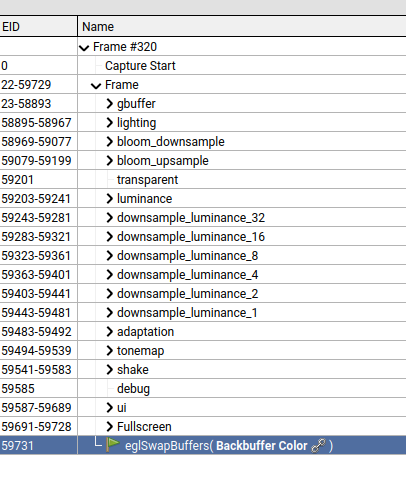

I chose OpenGL for several reasons. First, I’m very familiar with the API and can work with it efficiently. OpenGL strikes a balance between high-level functionality and low-level control, allowing me to avoid dealing with specifics that are not immediately relevant while still offering enough control over the aspects that matter to me. Overall, I find it to be a great API.

The decision to use a Clustered Deferred Renderer was driven by two main considerations:

* Rendering Many Lights: I wanted to efficiently handle the rendering of numerous lights in the scene.
* Proven Architecture: Clustered Deferred Rendering is a well-established approach used by many modern engines, which provides a robust and tested architecture.

By adopting Clustered Deferred Rendering, I align with a widely adopted method that should me setup well for more advanced techniques like Ray Tracing. Clustered Deferred Rendering is a improvement over the Deferred Rendering technique. It's characterized by two properties:

1. Deferred Rendering:

* Deferred Rendering is a technique where the rendering of geometry and lighting are decoupled into separate stages. In the first stage, the geometry of the scene is rendered to a series of textures known as the GBuffer (Geometry Buffer). This GBuffer holds information such as albedo, normals, and material properties. In the second stage, lighting is applied to this data, utilizing the information stored in the GBuffer. Deferred Rendering allows for complex lighting calculations and is particularly useful in scenes with many light sources.

2. Clustering:

* Clustering refers to the process of grouping or partitioning data into clusters or small volumes. In the context of Clustered Deferred Rendering, it involves dividing the screen space into a 3D grid of clusters or voxels. Each cluster represents a small region of the scene, and the lighting calculations are performed within these clusters. By organizing lights into these clusters, the renderer can efficiently manage and apply only the relevant lights for each pixel, reducing the computational load.

#### Frame Breakdown

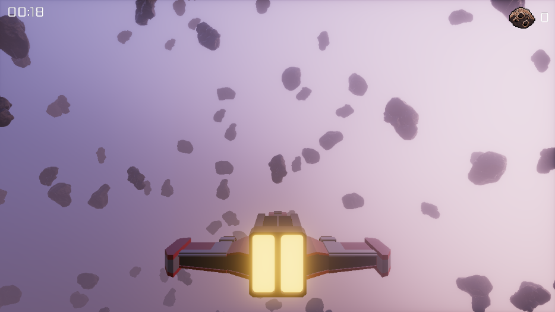

Let's take a look at how a frame gets composed in the engine.

##### GBuffer

In the GBuffer stage, all meshes in the scene are drawn to produce a GBuffer. The GBuffer is a collection of textures that store all the information required for shading the pixels in subsequent rendering stages. This stage effectively captures the scene’s geometry and material properties, which are then used to apply lighting and other effects.

GBuffer Components:

The GBuffer contains several key types of information:

* Albedo: The base color of the material.
* Emissive: The self-illumination of the material.
* Normals: The surface normal vectors, which are crucial for accurate lighting calculations.
* Metallic: The metallic property of the material, which influences how reflective it is.
* Roughness: The roughness of the material’s surface, affecting the spread of light reflections.
* Occlusion: Ambient occlusion information to simulate shadowing in crevices.
* Position: The world space position of each pixel.
* Shading Model: The specific shading model used for the material. Currently that is only Lit (PBR) and Unlit.

The following format is used for the GBuffer:

```c
B8G8R8A8_UNORM  // albedo + shading model
B8G8R8_UNORM    // emissive
R16G16_FLOAT    // normals
B8G8R8_UNORM    // metallic + roughness + occlusion
R32G32B32_FLOAT // position
```

I compress the normals with a technique called [Octahedral Encoding](https://twitter.com/Stubbesaurus/status/937994790553227264?s=20&t=U36PKMj7v2BFeQwDX6gEGQ). My format is far from optimal, but it gets the job done.

Here are screenshots from the individual outputs.

Albedo with shading model buffer

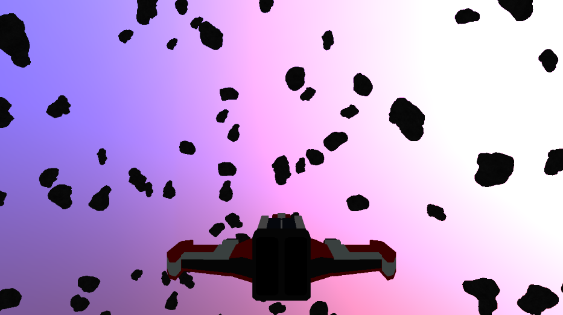

Emissive buffer


Normals buffer

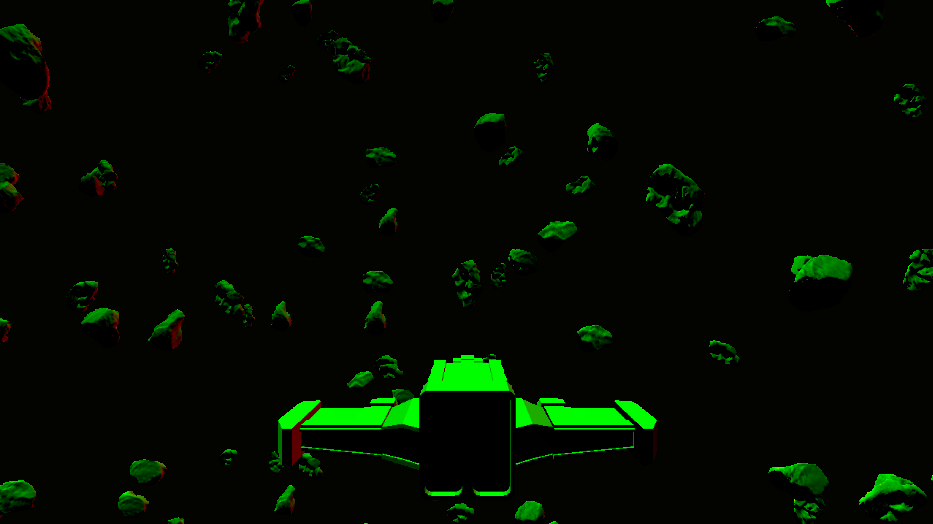

Metallic Roughness Occlusions buffer


Positions buffer

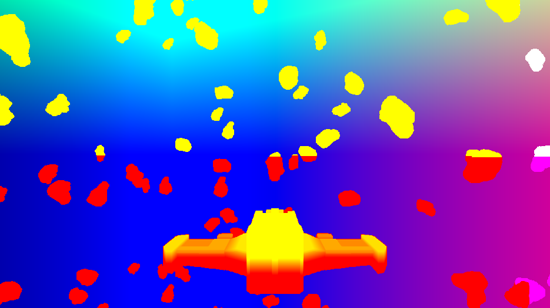

In addition, this stages outputs a depth buffer

##### Lighting

After the GBuffer is generated, it is processed during the lighting stage. To manage the lighting effectively, especially with the capability of supporting thousands of point lights, it's crucial to optimize the process to maintain good frame rates. Iterating over all lights directly for each pixel would be computationally prohibitive, so a more efficient approach is used. The view frustum gets clustered.

* Tile Division: The view frustum is divided into clusters or tiles. Each tile consists of a 2D bounding box and a depth range. This division allows the renderer to manage and optimize light calculations by associating lights with specific tiles rather than considering every light for every pixel.

* Light Assignment: During the light assignment pass, each tile is assigned the lights that affect it. This method significantly reduces the number of lights that need to be processed for each pixel, enhancing performance.

The light assignment gets done by a compute shader.

In this screenshot, you can see how the screen is divided into tiles. Note that elements like the sky and UI are not tiled because they are not affected by lighting.

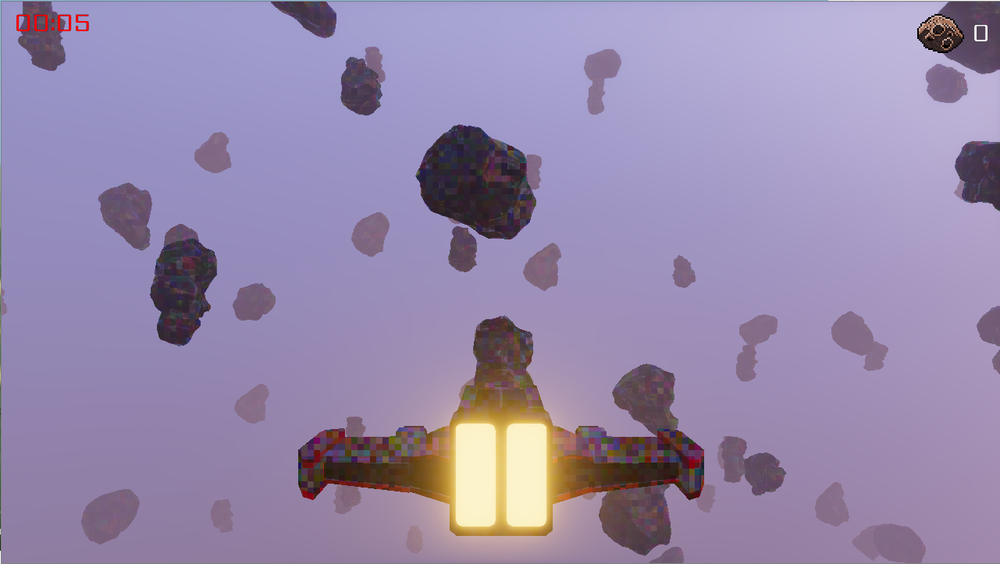

Another screenshot illustrates which tiles are affected by the point lights from rockets, with affected tiles marked in yellow:

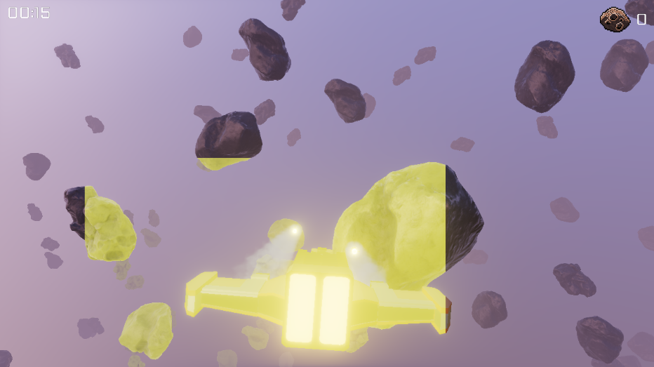

For shading, a Physically-Based Bidirectional Reflectance Distribution Function (PBR BRDF) is utilized. PBR provides a physically accurate model for how light interacts with surfaces, ensuring realistic material rendering and lighting effects.

To achieve realistic ambient lighting, a technique known as Image-Based Lighting (IBL) is employed. IBL could be described as a form of global illumination that uses an environment map to calculate ambient light. This method simulates how light interacts with the environment, providing a more immersive and realistic lighting effect. Than what are pure PBR implementation could achieve. IBL goes very well together with PBR.

The PBR and IBL implementation is based on the implementation of [3D Graphics Rendering Cookbook](https://www.packtpub.com/en-us/product/3d-graphics-rendering-cookbook-9781838986193?srsltid=AfmBOorSHD5kWqXPtNFlIlflOypMS4R8b_tqdUJOC8sC1CJzvYYFA7ut). The Clustered Deferred Rendering architecture is inspired by the book [Mastering Graphics Programming with Vulkan](https://www.packtpub.com/en-us/product/mastering-graphics-programming-with-vulkan-9781803244792?srsltid=AfmBOopM2E-AGT47Cij05zmSeLGboryDIzC9gDDdT7MIXwHnaTnynoyL).

##### Transparent

After the lighting stage is completed, the next step is the transparent forward pass. This stage handles the rendering of transparent objects, which requires special considerations to ensure correct visual results.

* Sorting:
Transparent objects are sorted from back to front. This sorting is crucial because, unlike opaque objects, the order in which transparent objects are rendered affects the final appearance. Objects further from the camera should be rendered first, allowing closer objects to blend correctly on top of them.

* Depth Test:
During the rendering of transparent objects, the depth test is disabled. This is because the depth buffer is not reliable for blending transparent objects. Disabling the depth test allows transparent objects to be correctly blended with the background and other transparent objects based on their sorted order.

* Shading:
Currently, transparent objects are not shaded at all. They are rendered with their base texture or color, without any additional shading effects applied. Transparent objects are currently only used for particle effects which do not require sophisticated shading. 

##### Bloom

To make bright colors appear truly luminous, a Physically-Based Bloom stage is applied. Bloom is a post-processing effect that simulates the way light bleeds and spreads beyond bright areas, creating a glowing effect around intense light sources.

The implmentation works like this:

* Isolation of Bright Areas:
In the first pass, the bright portions of the lighting texture are isolated. This step identifies areas in the image where the brightness exceeds a certain threshold, focusing on the regions that will contribute to the bloom effect.

* Downsampling:
The isolated bright areas are then downsampled over several passes. Downsampling reduces the resolution of the bright areas while retaining their high intensity. This step helps in blurring and creating the halo effect around bright lights.

* Upsampling:
After downsampling, the texture is upsampled to match the original resolution. This step reconstructs the high-resolution bloom effect from the downsampled texture, ensuring it blends well with the rest of the image.

* Blending:
The final upsampled bloom texture is blended on top of the lighting texture during the tone mapping stage. This integration enhances the overall visual appeal by adding a subtle glow to bright areas, making them appear more vivid and realistic.

My Bloom implementation is inspired by the techniques demonstrated in this [video](https://www.youtube.com/watch?v=tI70-HIc5ro) and the presentation from [Call of Duty](https://www.iryoku.com/next-generation-post-processing-in-call-of-duty-advanced-warfare/).

Here is a picture of the final upsampled bloom texture:

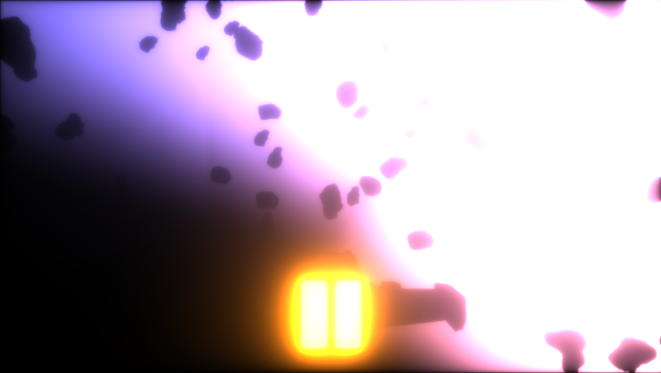

##### Tone Mapping

After the lighting and bloom stages, the resulting color textures may contain values that exceed the standard display range of (0, 0, 0) to (1, 1, 1). Simply merging these textures and displaying them could lead to undesirable results, where bright areas appear completely white due to the limited color range of computer displays. Tone mapping is the process used to map these high dynamic range (HDR) color values into a range that can be effectively displayed on standard monitors.

Tone mapping converts the high dynamic range colors into a lower dynamic range that can be displayed accurately on screens. This process helps in preserving detail in both bright and dark areas, creating a more visually pleasing and realistic image.

There are many different tone mapping algorithms, each with its own approach and characteristics. The choice of algorithm can significantly affect the final appearance of the image.
I use the ACES (Academy Color Encoding System) tone mapping algorithm, which is a widely adopted standard for high dynamic range imaging.

A crucial aspect of realistic tone mapping is adjusting for varying lighting conditions in the scene. To account fo that the light adaptation stage extracts the average brightness of the image by downsampling the lighting texture to a single pixel. This provides a measure of the overall scene brightness.

To ensure smooth transitions between bright and dark environments, the light adaptation algorithm gradually adjusts the tone mapping parameters over time. This dynamic adaptation helps in maintaining consistent exposure levels and visual comfort as the scene's lighting conditions change.

Finally, gamma correction is applied to adjust the final image to match the gamma characteristics of the display device.

My implementation of tone mapping was inspired by the implementation from [3D Graphics Rendering Cookbook](https://www.packtpub.com/en-us/product/3d-graphics-rendering-cookbook-9781838986193?srsltid=AfmBOorSHD5kWqXPtNFlIlflOypMS4R8b_tqdUJOC8sC1CJzvYYFA7ut).

##### UI, Debug

Finally the UI and debug drawing gets drawn above everything else. The following screenshots shows debug text with debug drawing of the physics colliders.

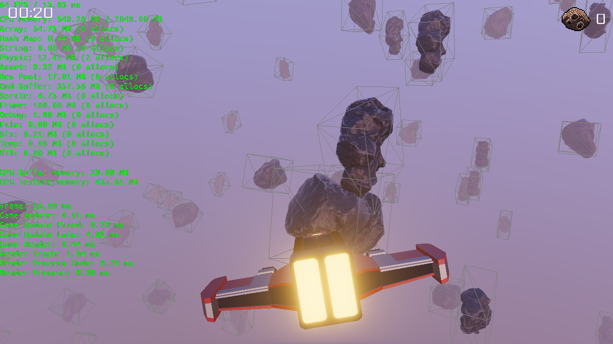

This completes a frame in my renderer.

#### Renderer Interface

OpenGL presents significant challenges due to its nature as a large state machine. When you change a state in OpenGL, all subsequent calls are affected by this change, making it difficult to manage and reason about the rendering process in larger projects. Additionally, OpenGL functions can only be invoked from a single thread, which can be a limitation in modern multi-threaded environments.

To address these issues, I created a custom rendering API on top of OpenGL that aims to be almost stateless and mimics the design principles of Vulkan's API. This approach simplifies managing rendering states and allows for multi threaded draw call submisson.

The system is inspired by the posts of [Molecular Matters](https://blog.molecular-matters.com/2014/11/06/stateless-layered-multi-threaded-rendering-part-1/).

The core of the renderer abstraction is based on a set of render resources. These resources include:

* Buffers: For storing data such as vertex positions and indices.
* Textures: For storing image data used in shading.
* Resource Layouts: For defining how data is organized and accessed.
* Resource Lists: For managing collections of resources.
* Pipelines: For configuring the rendering process.
* Shaders: For specifying the operations performed on the graphics pipeline.

Each of these resources is represented by a simple 32-bit integer handle.

The GPU device provides methods to create and manage these resources. For instance, you can create a buffer by specifying its type, size, and usage pattern, or create a texture by defining its dimensions, format, and other attributes. This process abstracts away the lower-level details of OpenGL.

```c
struct dc_buffer
{
    u32 id;
};

struct dc_texture
{
    u32 id;
};

dc_buffer dc_gpu_device_buffer_create (dc_gpu_device*  gpu_device,
                                       dc_buffer_desc* desc);

dc_buffer dc_gpu_device_texture_create (dc_gpu_device*  gpu_device,
                                        dc_buffer_desc* desc);

void dc_gpu_device_buffer_destroy(dc_gpu_device* gpu_device,
                                  dc_buffer      handle);

void dc_gpu_device_texture_destroy(dc_gpu_device* gpu_device,
                                   dc_buffer      handle);
```

Buffers can be categorized into several types: uniform, vertex, index, and storage. Similarly, textures come in different types such as 2D, Cube, and array. While most of these resources have direct equivalents in OpenGL, there are three resource types that do not: pipelines, resource layouts, and resource lists.

A pipeline encapsulates all the state information required for a draw call, including aspects such as blend state, rasterizer state, shaders, and bound resources. The creation of a pipeline involves defining these states and configurations, as illustrated in the following code sample:

```c
struct dc_pipeline_desc
{
    dc_rasterization_desc rasterization;
    dc_depth_stencil_desc depth_stencil;
    dc_blend_state_desc   blend;
    dc_vertex_input_desc  vertex_input;
    dc_shader_desc        shaders;

    dc_resource_layout resource_layouts[DC_MAX_RESOURCE_LAYOUTS];
    u32                resource_layouts_count;

    bool compute;

    char name[64];
};
```

Once a pipeline is created, it can be bound to a command buffer prior to issuing a draw call, ensuring that all the state information for that draw call is encapsulated.

Note that the name and resource_layouts fields are fixed-size arrays. I strive to avoid dynamic allocations wherever possible, and this approach generally suffices. It’s unlikely to need more than 8 resource layouts or names longer than 64 characters. This pattern, applied throughout the engine, simplifies memory management and avoids complexity.

A resource layout defines a set of resources that are bound to a shader. Meanwhile, a resource list represents the actual collection of resources bound to the shader. This concept is similar to Vulkan’s descriptor sets. For instance, a resource layout specifies where on the shader the resources should be bound and aligns with the layout lists described later in the material system. Resource layouts are primarily created automatically by the material system. Unless users create instanced resource lists in shaders, resource lists are also created automatically. More details on this will be covered in the material system section.

Resource layouts and lists streamline the process of binding resources and locating the correct slots in the shader. They also serve as a safeguard to ensure that all resources are properly bound before rendering.

```c
// Creation of a resource layout. The shader system will find the right 
// uniform slots on the shader by name.
dc_resource_layout_desc layout_desc = {0};
layout_desc.binding[desc.binding_count++] = { 
    DC_RESOURCE_TYPE_TEXTURE, 
    "u_tx_albedo",
};
layout_desc.binding[desc.binding_count++] = {
    DC_RESOURCE_TYPE_UNIFORMS,
    "pbr_globals",
};
dc_resource_layout layout = dc_gpu_device_resource_layout_create(gpu_device,
                                                                 &layout_desc);

// Create the matching resource list
dc_resource_list_desc list_desc = {0};
list_desc.layout = layout;
list_desc.resources[list_desc.resource_count++] = albedo_tex.id;
list_desc.resources[list_desc.resource_count++] = globals_buffer.id;
// Resources list a very cheap to create. They can be set to transient.
// That means they will be destroyed automatically when the frame has been
// drawn and can then be created again.
list_desc.transient = true;

// This call will verify that the resource list matches they layout.
// The checks can be disabled in release mode.
dc_resource_list list = dc_gpu_device_resource_list_create(gpu_device,
                                                           &list_desc);
```

All draw commands are recorded into command buffers, which are subsequently sent to the rendering backend. The advantage of using command buffers is that they allow for parallel recording, enabling multi-threaded draw call generation even with single-threaded APIs like OpenGL. When submitted, the rendering backend processes all command buffers and executes their commands, which can occur on a separate thread.

Command buffers extensively utilize the stack allocator to efficiently manage memory for command storage.

```c
// The command buffer gets allocated somewhere in the beginning of the frame
dc_cmd_buffer* cmd_buffer = dc_gpu_device_command_buffer(gpu_device);

// A usual draw command looks like the following. First the pipeline gets
// bound, then the resource lists (obtained from a material) get bound. And
// as a last step the index buffer gets bound.
// Finally a draw call can be executed.

dc_cmd_buffer_bind_pipeline(pipeline);
// This binds multiple resource lists at once
dc_cmd_buffer_bind_resource_list(resource_lists, resource_lists_count);
dc_cmd_buffer_set_index_buffer(cmd_buffer, index_buffer);
dc_cmd_buffer_draw_indexed(cmd_buffer, 0, indices_count);

```

Another interesting aspect of this abstraction is how uniform and storage buffers are updated. While this process is typically concealed from users through convenience functions, the following examples illustrate how it operates.

```c
// Allocate memory for the buffer update. This can be from any source but the
// memory needs to live as long until command buffer has been processed.
// The frame allocators are a good way to allocate some memory quickly without
// worries about the lifetime.
usize buf_mem_size = 2 * sizeof(mat4);
void* buf_mem = dc_stack_allocator_alloc(frame_allocator, buf_mem_size);
// Write the updated matrices into the freshly allocated memory
// Note that in the engine you don't have to perform that pointer arithmetic.
// That is hidden from the user for convinience.
dc_mem_set(buf_mem, buf_mem_size, &view_mat, sizeof(mat4));
dc_mem_set(buf_mem + sizeof(mat4),
           buf_mem_size - sizeof(mat4),
           &proj_mat,
           sizeof(mat4));
// This will queue a update buffer command in the command buffer.
// It's important that the memory buf_mem stays alive until the update is done.
// When using the frame allocator one can be sure that this is the case.
dc_cmd_buffer_update_buffer(cmd_buffer,
                            globals_buffer,
                            buf_mem,
                            0,
                            buf_mem_size);
```

This abstraction has served me very well so far. Command recording is both fast and capable of being done in parallel. Additionally, it allows for optimizations such as [ordering draw calls around](https://realtimecollisiondetection.net/blog/?p=86) to improve batching efficiency.

#### Material System

Building on top of the rendering abstraction, I developed a material system designed for complete configurability through text files. To achieve this, I created a custom lexer and parser, resulting in a system that allows me to define shaders, materials, their states, and required rendering resources using straightforward text files.

In addition to the configurable shaders and materials, the system also supports configuring uniform and storage buffers via text files. The engine automatically creates these buffers during startup, which helps minimize errors by ensuring that changes to data structures are consistently reflected both in shaders and on the C++ side. This approach provides a single source of truth for configuration.

Here’s an example of the GBuffer shader in my engine using this system, complete with comments to explain the various components.

```txt
shader gbuffer
{
    // Properties can be set by materials
    // A uniform buffer from the properties will be generated for the shader
    properties
    {
        vec4 u_albedo (0.2, 0.2, 0.2, 1.0)
        vec4 u_emissive (0.0, 0.0, 0.0, 1.0)
        vec4 u_metallic (0.2, 0.2, 0.2, 0.2)
        vec4 u_roughness (0.8, 0.8, 0.8, 0.8)

        // A texture declaration with a uniform name of u_tx_albedo.
        // By default (if the material doesn't specify otherwise)
        // the fallback texture __default_tex_albedo__ will be used
        // The linear_sampler tells the shader to sample this texture with
        // a linear sampler. Samplers can also be overwritten by materials.
        texture_2d u_tx_albedo "__default_tex_albedo__" linear_sampler
        texture_2d u_tx_normal "__default_tex_normal__" linear_sampler
        texture_2d u_tx_metallic_roughness "__default_tex_metallic_roughness__" linear_sampler
        texture_2d u_tx_emissive "__default_tex_emissive__" linear_sampler
        texture_2d u_tx_ao "__default_tex_ao__" linear_sampler
    }

    // The layout specifies the resource layout of the shader
    // A list is a collection of resources.
    // One or multiple lists can be bound to a shader.
    // It mostly makes sense to group resources together in a 
    // list that get changed together.
    layout
    {
        list pbr_gbuffer_list
        {
            // A uniform buffer that stores globals that are shared and used by
            // multiple shaders. The actual definition of the uniform buffer is
            // in a different file. It will be shown below.
            uniform_buffer pbr_globals

            // The pbr_instance uniform buffer holds information 
            // that are specific to the object being rendererd. 
            // E.g. model matrix
            uniform_buffer pbr_instance
        }

        // Another resource list. Note of the keyword instance behind list.
        // It indicates that the shader shouldn't load the resources in this
        // list automatically. Its the responsibility of the person that 
        // invokes that shader to bind that resource list. The system will 
        // throw an error if this list is not bound when trying to draw.
        // The mesh_vertices_buffer contains the actual vertex data of the 
        // mesh that gets drawn. Its basically a vertex buffer. Instead of
        // making use of vertex buffers I use a technique called vertex
        // pulling to pull the vertices from storage buffers. This has the
        // benefit to simplify the pipeline handling in some cases. E.g.
        // skeletal animation is easier to achieve this way.
        list instance mesh_data_list
        {
            storage_buffer readonly restrict mesh_vertices_buffer
        }
    }

    // Configure the samplers that get used by this shader.
    // Each texture that gets used can specify which sampler it wants to use.
    sampler_states
    {
        state linear_sampler
        {
            Filter MinMagMipLinear
            AddressU Repeat
            AddressV Repeat
        }
    }

    // The render states encapsulate the blend and raserizer state
    // for the shader.
    render_states
    {
        state solid
        {
            Cull Back
            ZTest LEqual
            ZWrite On
        }
    }

    // The glsl block contains actual shader code. The shader code is just
    // regular GLSL code. The possibility to include other GLSL files was
    // added.
    // Note how it's not necessary to specify any uniform buffers or samplers.
    // This will all be automatically generated from the layout and properties
    // above.
    glsl pbr_gbuffer_vert
    {
        #include "vertex.glsl"

        out vec3 v_ws_pos;
        out vec3 v_ws_normal;
        out vec2 v_uv;

        void main()
        {
            vec3 pos = get_position(gl_VertexID);
            vec3 normal = get_normal(gl_VertexID);
            vec2 uv = get_uv(gl_VertexID);

            vec4 P = u_m_world * vec4(pos, 1.0);
            v_ws_pos = P.xyz / P.w;
            mat3 normal_matrix = transpose(inverse(mat3(u_m_world)));
            v_ws_normal = normalize(normal_matrix * normal);
            v_uv = uv;

            gl_Position = u_m_proj * u_m_view * P;
        }
    }

    // Another glsl block for the fragment shader
    glsl pbr_gbuffer_frag
    {
        #include "common.glsl"
        #include "gbuffer_write.glsl"

        in vec3 v_ws_pos;
        in vec3 v_ws_normal;
        in vec2 v_uv;

        void main()
        {
            vec3 albedo = srgb_to_rgb(texture(u_tx_albedo, v_uv)).rgb
                        *  u_albedo.rgb;
            vec3 emissive = srgb_to_rgb(texture(u_tx_emissive, v_uv)).rgb
                          * u_emissive.rgb;
            vec2 metallic_roughness = texture(u_tx_metallic_roughness,
                                              v_uv).yz;
            float roughness = metallic_roughness.x * u_roughness.x;
            float metallic = metallic_roughness.y * u_metallic.x;
            float occlusion = texture(u_tx_ao, v_uv).r;
            vec3 normal = normalize(normal_from_tx());

            write_gbuffer(v_ws_pos,
                          albedo,
                          emissive,
                          normal,
                          metallic,
                          roughness,
                          occlusion,
                          SHADING_MODEL_LIT);
        }
    }

    // The pass is where everything comes together. A shader may have
    // multiple passes.
    // The pass specifies the shaders, resources and render states.
    pass pbr_gbuffer_solid
    {
        resources = pbr_gbuffer_list, mesh_data_list
        vertex_shader = pbr_gbuffer_vert
        fragment_shader = pbr_gbuffer_frag
        rasterizer = solid
    }
}
```

The uniform and storage buffers used in the shader above get configured in text files as well. Here is how the definiton of the globals buffer look like.

```txt
uniform_buffer pbr_globals
{
    mat4 u_m_proj
    mat4 u_m_view
    vec4 u_ws_cam_pos
    vec4 u_ws_cam_up
    vec4 u_ws_cam_right
    vec4 u_near_far_resx_resy
    vec4 u_fog_density
    vec4 u_fog_color
    float u_delta_time
    float u_time
    uint u_enable_fog
}
```

The engine automatically creates a uniform buffer of the appropriate size and allows users to set variables by name if desired. The shader can then access this uniform buffer automatically, thanks to a centralized render database. This render database maintains all the resources that shaders and the renderer may utilize.

Below is an example of a material that utilizes the shader mentioned above:

```txt
material asteroid1_rock1
{
    shader "shaders/gbuffer.sfx"

    properties
    {
        vec4
        {
            name u_albedo
            value (1.000000, 1.000000 , 1.000000, 1.000000)
        }
        vec4
        {
            name u_emissive
            value (0.000000, 0.000000 , 0.000000, 1.000000)
        }
        vec4
        {
            name u_metallic
            value (1.000000, 0.000000 , 0.000000, 0.000000)
        }
        vec4
        {
            name u_roughness
            value (1.000000, 0.000000 , 0.000000, 0.000000)
        }
        texture_2d
        {
            name u_tx_albedo
            value "/textures/asteroid1_rock1_albedo.png"
            sampler linear_sampler
        }
        texture_2d
        {
            name u_tx_normal
            value "/textures/asteroid1_rock1_normal.png"
            sampler linear_sampler
        }
        texture_2d
        {
            name u_tx_metallic_roughness
            value "/textures/asteroid1_rock1_ao-rock1_roughness_metallic.png"
            sampler linear_sampler
        }
        texture_2d
        {
            name u_tx_emissive
            value "__default_tex_emissive__"
            sampler linear_sampler
        }
        texture_2d
        {
            name u_tx_ao
            value "/textures/asteroid1_rock1_ao-rock1_roughness_metallic.png"
            sampler linear_sampler
        }
    }
}
```

Updating uniforms and binding a material looks like this

```c
// Somewhere on startup acquire a reference to the global uniform buffer
ubuffer_globals = dc_renderer_find_ubuffer(renderer, "pbr_globals");

// Before rendering update the buffer
dc_ubuffer_begin_draw(ubuffer_globals, frame_allocator);
dc_ubuffer_set_mat4(ubuffer_globals, "u_m_proj", &proj_mat);
dc_ubuffer_set_mat4(ubuffer_globals, "u_m_view", &view_mat);
// Submit the updated uniforms to the GPU
// This will queue a update buffer command into the command buffer
dc_ubuffer_update(ubuffer_globals, cmd_buffer);
```

Not only is the material system fully configurable through text files, but the renderer itself is also configured in this manner. The entire renderer is organized using a render graph, which determines the order of pass execution and manages dependencies between them.

Below is a simple configuration for a forward renderer’s render graph. This graph includes a pre-depth pass and a color pass. Notice how the outputs of the pre-depth pass are used as inputs for the color pass.

```txt
render_graph forward
{
    passes
    {
        pass depth_pre
        {
            outputs
            {
                attachment depth
                {
                    format D32_FLOAT
                    operation clear
                }
            }
        }

        pass opaque
        {
            inputs
            {
                texture depth
            }

            outputs
            {
                attachment final
                {
                    format R8G8B8A8_UNORM
                    operation clear
                }
            }
        }
    }
}

```

The render graph automatically creates all the necessary textures, simplifying the process of implementing new render stages and ensuring that barriers are inserted automatically. Render stages themselves are implemented in C++ and can be registered with the render graph.

Here’s an example of what a render stage might look like. It's one of the few instances where inheritance and virtual functions might be beneficial. In my engine, however, the render stage is represented as a simple struct containing function pointers and an optional user_data pointer for storing additional context.

```c
struct dc_render_stage
{
    void* user_data;

    void (*pre_render) (dc_cmd_buffer*         cmd_buffer,
                        const dc_render_scene* render_scene,
                        void*                  user_data);

    void (*render)     (dc_cmd_buffer*         cmd_buffer,
                        const dc_render_scene* render_scene,
                        u32                    width,
                        u32                    height,
                        f32                    delta_time,
                        void*                  user_data);

    void (*resize)     (dc_gpu_device* gpu_device, 
                        u32            width, 
                        u32            height, 
                        void*          user_data);
};
```

Render stages registration is straight forward:

```c
dc_render_graph_register_stage(render_graph, "gbuffer", gbuffer_stage);
```

The Gbuffer stage's render function may looks like this: 

```c
void gbuffer_pass_render (dc_cmd_buffer*         cmd_buffer,
                          const dc_render_scene* render_scene,
                          u32                    width,
                          u32                    height,
                          f32                    delta_time,
                          void*                  user_data)
{
    for (u32 i = 0; i < render_scene.models_count; ++i)
    {
        dc_model_gpu* model        = render_scene.models[i];
        mat4*         model_matrix = &render_scene.model_matrices[i];

        for (u32 i = 0; i < model->meshes_count; ++i)
        {
            dc_mesh_gpu* mesh     = &model->meshes[i];
            dc_material* material = mesh.material;

            mat4 normal_mat = mat4_transpose(mat4_inverse(world));

            // Update instance uniform buffer
            dc_ubuffer_begin_draw(instance_ub, render_scene->frame_allocator);
            dc_ubuffer_set_mat4(instance_ub, "u_m_world", &world);
            dc_ubuffer_set_mat4(instance_ub, "u_m_normal", &normal_mat);
            dc_ubuffer_update_buffer(instance_ub, cmd_buffer);

            // Update the resource list that gets attached to the
            // shader for this draw call.
            // The resource list contains the information where the shader
            // can find the vertex buffer for this mesh
            dc_material_set_resource_list(material,
                                          "mesh_data_list",
                                          mesh.vertices_list);

            // Bind the material for the draw call
            // This makes sure that all resource lists have been bound
            // Note how the name matches the name of the pass specified
            // in the shader file.
            dc_shader* shader = material->shader;
            i32 pass_index = dc_shader_pass_index(shader, "pbr_gbuffer_solid") 
            dc_material_bind(material,
                             pass_index,
                             cmd_buffer,
                             render_scene->frame_allocator);

            // Bind the index buffer and execute the draw call
            dc_cmd_buffer_bind_index_buffer(cmd_buffer, mesh.index_buffer);
            dc_cmd_buffer_draw_indexed(cmd_buffer,
                                       DC_TOPOLOGY_TRIANGLE, 
                                       mesh.index_count, 
                                       0,
                                       0,
                                       0,
                                       0);
        }
    }
}
```

This system has proven effective, allowing me to create new shaders and render stages with relative ease. However, there are still some rough edges that need refinement, and its robustness will be tested as I implement more complex rendering algorithms.

For the shader and material system, as well as the render graph, I was initially inspired by [these blog posts](https://jorenjoestar.github.io/post/data_driven_rendering_pipeline/) and [this book](https://www.packtpub.com/en-us/product/mastering-graphics-programming-with-vulkan-9781803244792?srsltid=AfmBOorl5bd9_kCEJXe-iW4Qm0qGJ3hZZECcM7qG6Niyl2nRYHpyBYHU).

## Game UI

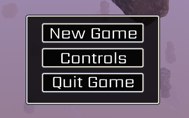

For the game UI, I developed a straightforward yet effective system capable of displaying user interfaces that adapt to different screen sizes. This system is built on top of a 2D sprite renderer, which efficiently batches and renders sprites in a single draw call. A sprite is just a quad with a texture applied on it.

One of the main challenges with UI systems, aside from layout management, is font rendering. My engine supports both [True Type Fonts (TTF)](https://en.wikipedia.org/wiki/TrueType) and [Bitmap Fonts](https://en.wikipedia.org/wiki/Computer_font#Bitmap_fonts). Bitmap fonts are highly efficient for rendering but come with the limitation of fixed sizes. To change the size, you would need to scale the font, which can lead to quality degradation. TTF fonts, however, are more versatile and maintain quality across various sizes.

Parsing TTF files can be complex, so I opted to use a library for that purpose. For those interested in a thorough introduction to text rendering, I recommend this [YouTube series](https://www.youtube.com/watch?v=zvGIp-S2mxA).

For the layout system I was inspired by [this blog post](https://edw.is/learning-vulkan/#ui) and it contains an excellent explanation how it works.

## Asset Management

My asset management system is designed to be straightforward, as the games I plan to develop are relatively simple and do not require advanced asset management techniques. Should the need arise for a more sophisticated system in the future, then I will need to address it accordingly.

The core of my asset management is a central asset store that can register various asset loaders. When an asset needs to be loaded at runtime, the asset store identifies the appropriate loader based on the file extension and ensures that the asset is loaded only once. If an asset has already been loaded, it is retrieved from a hash map to prevent redundant loading operations.

For most assets, I use a custom binary file format. This choice facilitates quick loading of assets at startup and eliminates certain runtime dependencies. To generate these custom asset files, I employ a separate asset importer tool that converts source files into a format that the engine can process.

### Audio

The engine supports playback of both [WAVE](https://en.wikipedia.org/wiki/WAV) and [Ogg](https://en.wikipedia.org/wiki/Ogg) files. WAVE files contain uncompressed PCM data, while Ogg files compress PCM data in a manner similar to MP3, with Ogg being an open and free format. I chose Ogg over MP3 due to its open nature.

For audio handling, I use [OpenAL](https://www.openal.org/), a powerful library for audio playback. [This guide](https://indiegamedev.net/2020/02/15/the-complete-guide-to-openal-with-c-part-1-playing-a-sound/) provides a comprehensive overview of using OpenAL, while the book [Mastering Andoid NDK](https://www.packtpub.com/en-us/product/mastering-android-ndk-9781785288333?srsltid=AfmBOootAqkigZJ7UqaTsa4V3miCYxS9hePYx7okmymDOMptJedjMZXQ) offers insights into building a more advanced audio system on top of OpenAL.

The main challenge with the audio system was to stream audio data into the audio buffers while the game is running. This is for example needed for long running tracks like the background music. To work around this I start a separate audio thread that keeps the buffers filled all the time.

```c
// A audio source maps to a OpenAL audio source with buffers attached to it
// A audio source can be placed in the world and emits sound.
struct dc_audio_source
{
    u32 source_id;

    u32 buffer_id[2];
    i32 buffer_count;

    dc_pcm_data* pcm_data;

};

// Definition of the required data for the audio thread
struct dc_audio_thread
{
    dc_thread thread;
    dc_atomic is_init;

    ALCdevice*  alc_device;
    ALCcontext* alc_context;

    dc_mutex         active_sources_mutex;
    dc_audio_source* active_sources;
    u32              active_sources_count;
};
```

Audio sources can be registered with the audio thread. Only when a audio source is registered it will be played. The audio thread keeps the audio buffers for a audio source filled in case streaming is required.

The following shows the main loop of the audio thread.

```c
while (!dc_thread_exit_requested(&audio_thread.thread))
{
    timer.tick();

    // Iterate over all audio sources and update them
    dc_mutex_lock(&audio_thread->active_sources_mutex);
    for (usize i = 0; i < audio_thread->active_sources_count; ++i)
    {
        dc_audio_source* source = audio_thread->active_sources_[i];
        dc_audio_source_update(source);
    }
    dc_mutex_unlock(&audio_thread->active_sources_mutex);

    dc_sleep(100);
}
```

The `audio_source_update()` function takes care of requesting new buffers in case the buffers run out of data.

```c
void dc_audio_source_update(dc_audio_source* source)
{
    if (!is_playing())
    {
        return;
    }

    if (source->pcm_data && dc_pcm_data_streaming(source->pcm_data))
    {
        i32 processed = 0;
        alGetSourcei(source->source_id, AL_BUFFERS_PROCESSED, &processed);

        while (processed--)
        {
            u32 buffer_id = 0;
            alSourceUnqueueBuffers(source->source_id, 1, &buffer_id);
            // Load new data into the OpenAL buffers
            dc_audio_stream_buffer(source, buffer_id);
            alSourceQueueBuffers(source->source_id, 1, &buffer_id);
        }
    }
}
```

OpenAL supports spatial audio, and in my implementation, the position of the audio listener can be adjusted using a few straightforward functions.

```c
void dc_audio_set_listener_position (const vec3& position);

void dc_audio_set_listener_velocity (const vec3& velocity);

void dc_audio_set_listener_orientation (const vec3& forward, const vec3& up);
```

One impotant thing to keep in mind is that when moving the listener the sound that get played by the UI need to be set to relative position. Otherwise they will in most cases not be hearable.

```c
void dc_audio_source_set_relative(b8 relative);
```

## Physics

Physics in my engine get handled by [Jolt](https://github.com/jrouwe/JoltPhysics). Writing a own physic engine is quite a difficult task and I leave
that for another project. Integration with the physic engine and the game code is already challenging enough.

## ECS

An Entity-Component System (ECS) is a widely used architectural pattern in game development that facilitates the composition of various functionalities for game entities. Popular C++ implementations include [EnTT](https://github.com/skypjack/entt) and [flecs](https://github.com/SanderMertens/flecs).

For my engine, I opted to create a custom ECS implementation rather than relying on third-party solutions. I initially based my implementation on the sparse array approach from EnTT. However, I found that my version was less efficient compared to EnTT, leading me to reconsider its use. I plan to explore an alternative ECS design inspired by flecs' archetype system, but I haven’t yet had the opportunity to do so. In the interim, my engine functions effectively without a formal ECS. Given the simplicity of the games I intend to create, straightforward arrays and structs have proven sufficient for my needs.

## Deployment

An essential aspect of game development is the process of shipping the game. Unlike regular applications, games bundle a variety of additional data such as textures, meshes, and shaders. There are several approaches to handling this challenge:

1. Distributing Executable with Separate Assets: One method is to package the game executable along with all its asset files in a zip archive. Users would then need to extract the zip file and ensure that the asset files remain in the same directory as the executable. This approach can be cumbersome for users, who must understand the importance of keeping the data files together with the executable to avoid potential issues or crashes.

2. Executable and Separate Zip File: Another approach is to bundle all the assets into a separate zip file and distribute both the executable and the zip file. Users simply need to place both files in the same directory, but this still requires them to manage multiple files.

3. Bundling Assets Inside the Executable: The approach I chose is to embed all game assets directly into the executable. This simplifies distribution to a single file, which is easy for users to download and run. The downside is that the executable file becomes quite large, which may be impractical for larger games but is manageable for smaller ones.

My packaging process is as follows:

* A Python script compresses all game data into a zip file.
* A C script then converts this zip file into a C source file containing a byte array with the zip data.
* This C source file is compiled together with the game code.
* The game code includes logic to detect that the data is embedded within the executable.
* At runtime, the game mounts this byte array as a virtual file system. The virtual file system decompresses the zip data and presents it as a usable file system.
* This method ensures that users only need to handle a single executable file, minimizing potential errors and simplifying the installation process.

## Final Words

This completes a brief overview of the engine. It has been a fun project and there are a lot of things I still want to implement. I'm already working on a next game prototype to develop the tech in the engine further. Developing this project teached me a lot. I gained a lot of my programming skills from that project over the last couple of years. A side project like this lets you try out things that you will very seldom be able to do in your professional work.

I want to use the oppurtunity to show some screenshots from game engine and game projects I did before but never published.

A voxel engine that could generate infinite terrain. Inspired by Minecraft.


This was a attempt on building a general purpose engine. The engine looks nice but is barley useful. It contains implementations for shadows.


A 2D platformer game

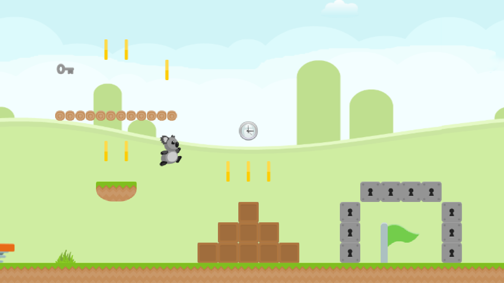

## Resources

Many books, articles, and videos contributed to the knowledge needed to complete a project like this. Here, I want to share some resources that I found particularly useful. I am very grateful to those who share and write these books and articles.

* Books
    - [3D Graphics Rendering Cookbook](https://www.packtpub.com/en-us/product/3d-graphics-rendering-cookbook-9781838986193?srsltid=AfmBOoq7w3_NmzLs2zh4yBitraf0JjoX0ecaO7sh-YYhUzBIMeTPzJm8)
    - [Mastering Graphics Programming with Vulkan](https://www.packtpub.com/en-us/product/mastering-graphics-programming-with-vulkan-9781803244792?srsltid=AfmBOooSMOvDDKQoW3PbyByotLuH7eNUD0e_mZIE2H1RgYHncA-i-43Q)
    - [Real-Time Collision Detection](http://www.r-5.org/files/books/computers/algo-list/realtime-3d/Christer_Ericson-Real-Time_Collision_Detection-EN.pdf)
    - [Game Coding Complete](https://www.mcshaffry.com/GameCode/?s=1273b27b7df08d323ce53de4eae1d7e2fe04dec4)
    - [Real-Time Rendering](https://www.realtimerendering.com/)
    - [OpenGL 4 Shading Language Cookbook](https://www.packtpub.com/en-us/product/opengl-4-shading-language-cookbook-9781789342253?srsltid=AfmBOop9en-2s_fQy0oVnhRIEQiVGavC4RR7ALJ_-BXJ0d9P7dHyD633)
    - [The OpenGL Programming Guide](http://www.opengl-redbook.com/)
    - [OpenGL SuperBible](https://www.opengl.org/sdk/docs/books/SuperBible/)

* Internet Articles
    - [LearnOpenGL](https://learnopengl.com/)
    - [Ordering your draw calls around](https://realtimecollisiondetection.net/blog/?p=86)
    - [Stateless, layered, multithreaded rendering](https://blog.molecular-matters.com/2014/11/06/stateless-layered-multi-threaded-rendering-part-1/)
    - [Vulkan Guide](https://vkguide.dev/)
    - [Data Driven Rendering](https://jorenjoestar.github.io/post/data_driven_rendering_pipeline/)
    - [Wicked Engine Devblog](https://wickedengine.net/category/devblog/)
    - [Learning Vulkan](https://edw.is/learning-vulkan/)

* YouTube Videos
    - [niagara](https://www.youtube.com/watch?v=BR2my8OE1Sc&list=PL0JVLUVCkk-l7CWCn3-cdftR0oajugYvd)
    - [Kohi - Vulkan Game Engine Series](https://www.youtube.com/watch?v=dHPuU-DJoBM&list=PLv8Ddw9K0JPg1BEO-RS-0MYs423cvLVtj)
    - [Handmade Hero](https://www.youtube.com/watch?v=Ee3EtYb8d1o)
