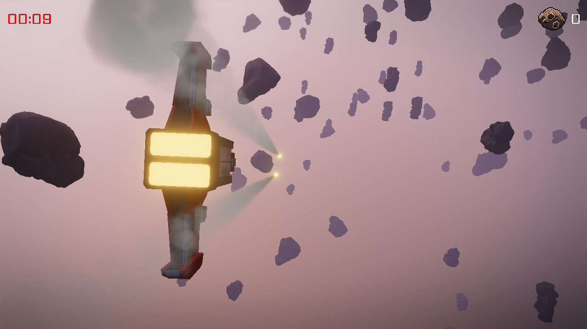
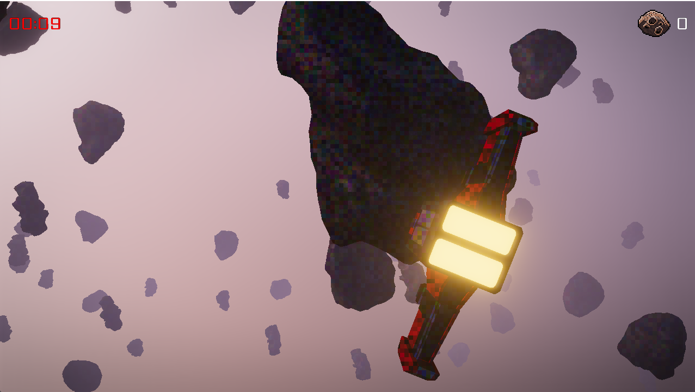
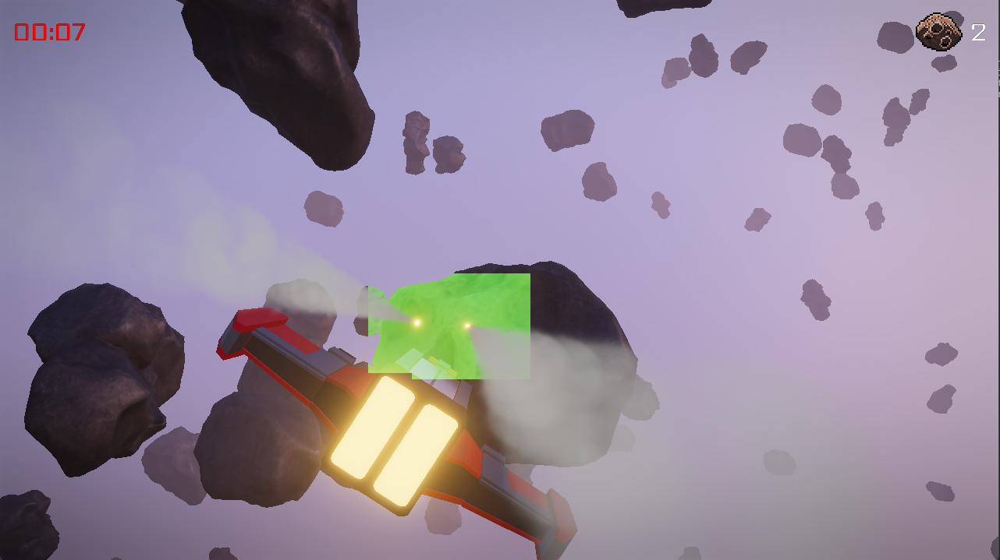

## TL;DR;

In this post, I'll explain a rendering technique called Clustered Rendering, which I used in [my game engine]() to efficiently render (possibly) thousands of point lights. Clustered Rendering is compatible with both Forward and Deferred rendering architectures. When combined with Forward rendering, it's often referred to as Forward+.



## Table Of Contents

- [Preface](#preface)
- [How Clustered Rendering Works](#how-clustered-rendering-works)
- [Implementation](#implementation)
  - [Bin Mapping](#bin-mapping)
  - [Tile Mapping](#tile-mapping)
  - [Lighting Computation in the Shader](#lighting-computation-in-the-shader)
  - [Code](#code)
- [Resources](#resources)


## Preface

When doing real-time rendering for games, especially 3D games, we usually want to light the scene dynamically. Games commonly use three types of lights: Directional Lights, Point Lights, and Spot Lights.

* Directional Lights are ideal for simulating sunlight, providing consistent lighting across large areas. 

* Spot Lights are useful for effects like flashlights or car headlights, where the light is focused in a particular direction. 

* Point Lights simulate localized light sources such as torches, campfires, street lights, explosions, etc. They can also be strategically placed to approximate global illumination at a lower cost, since true global illumination calculations are often prohibitively expensive. 

To make 3D games look visually appealing, we often want to render many point lights within a scene. Unfortunately, rendering a scene with a large number of lights can be highly demanding.

Traditionally, scenes are rendered using a technique called Forward Rendering. This approach involves drawing model after model and, for each model, iterating through every light source to compute shading. If we have 1,000 point lights, that means every pixel being drawn must iterate over all 1,000 lights to determine the final shading. This approach can be very inefficient, especially if some pixels are later overwritten by other models (overdraw).

Some techniques attempt to improve efficiency, such as performing an early depth pass or using Deferred Rendering. In Deferred Rendering, shading calculations are postponed until after we determine which pixels are visible in the final image. This way, we still need to iterate over all lights for each pixel, but at least we avoid wasting computation on pixels that don’t contribute to the final picture.

However, even with Deferred Rendering, iterating over all 1,000 point lights per pixel is unnecessary. Most pixels are only influenced by a small subset of lights—often just one or two. This is where Clustered Rendering comes in. Clustered Rendering improves efficiency by dividing the scene into a 3D grid of clusters, allowing us to quickly determine which lights affect which parts of the scene. Importantly, Clustered Rendering works with both Forward Rendering and Deferred Rendering, making it a versatile and powerful optimization technique.

# How Clustered Rendering Works

The technique I present here is adapted from the book [Mastering Graphics Programming with Vulkan](https://www.packtpub.com/en-us/product/mastering-graphics-programming-with-vulkan-9781803244792?srsltid=AfmBOooSMOvDDKQoW3PbyByotLuH7eNUD0e_mZIE2H1RgYHncA-i-43Q). I highly recommend this book as it provides a wealth of valuable information on advanced graphics programming. The technique was originally introduced in an [Presentation from Activision about Call of Duty](https://www.activision.com/cdn/research/2017_Sig_Improved_Culling_final.pdf), which also includes insights on making the algorithm more efficient. However, this blog post will focus on implementing the basic technique.

In this article, I'll explain and demonstrate the code I used in my game engine to implement Clustered Rendering within a Deferred Rendering setting. Note that there are various ways to implement Clustered Rendering—what I’ll show here is just one possible approach.

Clustered Forward Rendering works by dividing the camera’s view frustum (the region of space visible to the camera) into a voxel-like structure. A voxel is essentially a 3D pixel, representing a small volume in space.

The following picture shows the tiles. Every tile has a different color. Note, that the background/skybox isn't tiled. That is because it
doesn't get shaded in a different way.



The process can be broken down into the following steps:

* The frustum is divided along the depth direction (usually the Z-axis in OpenGL) into discrete sections called Bins. For example, we might divide the frustum into 16 bins.

* The screen is further divided into a grid of Tiles, where each tile represents a block of pixels. A common choice is tiles of size 8x8 pixels.

* Each region within the frustum can be uniquely identified by a combination of a Tile and a Bin.

* Each point light is assigned a radius, which defines the maximum area it can influence. By comparing the position and radius of each point light to the tiles and bins, we can determine which parts of the frustum each light affects.

* When shading a pixel, we determine which tile and bin it belongs to, then look up the point lights that influence that specific region. As a result, we only need to iterate over the relevant point lights for each pixel, significantly reducing computational overhead.

The performance benefits of this approach become more apparent as the number of point lights increases. By culling irrelevant lights early, we avoid unnecessary calculations. However, there are some limitations to consider:

If there are only a few point lights, the overhead of assigning lights to tiles and bins may outweigh the benefits.

If all point lights are within a small area, little to no culling will occur, reducing the effectiveness of the technique. However, this scenario is rare in typical scenes.

The following screenshot marks the tiles green that are affected by a point light. Note, that tiles that are farther away than the lights radius are not affected by any point light.



In the following sections, I will walk through the code implementation of this technique and highlight important details.

# Implementation

Let's start with the CPU-side data structures and code that make this technique work. The code snippets you'll see are taken directly from my engine.

We first need to define some constants:

```C
/// Maximum number of point lights that can be rendered. Could be a higher number as well.
#define X_MAX_POINT_LIGHTS 1000
/// The number of Bins. The Bins divide the frustum in z direction.
#define X_LIGHT_Z_BINS 16
/// The width and height of a tile in pixels.
#define X_LIGHT_TILE_SIZE 8
///
#define X_WORDS_PER_TILE_COUNT ((X_MAX_POINT_LIGHTS + 31) / 32)
```

Now that we’ve established our constants, the next step is to define the buffers we’ll need on the CPU side. These buffers will store data about lights, tiles, and bins, which will be passed to the GPU for rendering.

We'll use the following buffers:

* `lights_ubuffer` — This uniform buffer stores a small amount of data, such as global constants related to lighting.

* `point_lights_buffer` — * This storage buffer holds information about all point lights in the scene, including their positions, and colors.

* `point_lights_lut_buffer` — This storage buffer is a lookup table that stores which point lights belong to which Bin.

* `point_lights_indices_buffer` — This storages buffer stores indices pointing to entries in point_lights_buffer.

* `point_lights_tiles_buffer` — This storage bufffer stores which light belongs to a given tile.

You might wonder what the difference is between Uniform Buffers and Storage Buffers.

* Uniform Buffers: Designed for storing small amounts of data, such as constants or matrices, that need to be passed to shaders. They have strict size limits and are sometimes faster to access.

* Storage Buffers: Designed for handling large blocks of data, such as arrays of lights. They can be read from and written to by shaders, making them more versatile but potentially slower.

In theory, a Storage Buffer can replace a Uniform Buffer, but not the other way around. However, for small pieces of data, using a Uniform Buffer is often more efficient due to hardware-specific performance optimizations.

Lets take a look at the defintions of these buffers:

`lights_ubuffer` looks like this:

```C
uniform_buffer pbr_lights
{
    // World space light direction of directional lights
    vec4 ws_dir_light_dir[4]
    // Color of directional lights
    vec4 dir_light_colors[4]

    // Number of point lights that get rendered this frame
    uint point_light_count
    // Number of directional lights in the scene
    uint dir_light_count
    // Whether IBL (Image-Based Lighting) is enabled
    uint enable_ibl

    // Some padding
    uint pad0
}
```
For this example only the `point_light_count` variable is of interest.

`point_lights_buffer` stores an array of the struct `point_light`. It contains as many `point_light` struct as `point_light_count`.

```C
struct point_light
{
    vec3 position
    float radius
    vec3 color
    float intensity
}
```

`point_lights_lut_buffer` is a bit more technical. It contains an array of `uint` (unsigned integers). `point_lights_indices_buffer` contains an array of `uint` as well.

Last we have `point_lights_tiles_buffer` which contains an `uint` array as well.

Before diving into the code, let’s break down how the algorithm works on the CPU side. The process is repeated every frame to account for dynamic lighting. The steps are as follows:

1. Sort the lights by distance from the camera. Instead of sorting the entire point light data, we only sort a list of indices referencing the point lights. This minimizes unnecessary data copying during sorting, making it more efficient.

2. Upload all point lights to the storage buffer point_lights_buffer. After sorting, the point light data is uploaded to the point_lights_buffer storage buffer for use by the GPU.

3. Compute the LUT (Look-Up Table) for the bins. The LUT allows us to efficiently map lights to bins in the shader. To build this table, we start by dividing the Z frustum into bins. For each light, we determine the minimum and maximum Z values it influences based on its position and radius. This information is then stored in the corresponding bins. Making this step efficient requires some special handling, which I’ll explain in detail later.

4. Upload the built LUT to point_lights_lut_buffer. Once the LUT is constructed, it is uploaded to the `point_lights_lut_buffer` storage buffer.

5. Assign each light to a tile. For each light, we construct an axis-aligned bounding box (AABB) based on the light’s radius. This AABB is then projected into screen coordinates to determine all the tiles influenced by the light. Efficiently storing this information also involves some special handling, which I'll explain later.

6. Upload the computed tile information to the storage buffer `point_lights_tiles_buffer`. The final step is to upload the tile information generated in the previous step to the `point_lights_tiles_buffer` storage buffer.

On the GPU side, we use the information generated on the CPU to determine which lights contribute to the shading of each pixel. Before diving into the code, let’s first understand how the mapping from lights to bins works.

We have a sorted list of light indices, sorted from front to back. This allows us to store only the first and last index of the lights belonging to each bin to access all relevant light indices for that bin.

### Bin Mapping

For each bin, we store the first and last light index as a single 32-bit unsigned integer. This means:

* The upper 16 bits hold the last index.
* The lower 16 bits hold the first index.

By using this encoding, we limit the maximum number of lights to 65535. While this constraint is acceptable for most scenes, it’s worth noting that lifting this limit would double memory usage.

Therefore, our `point_lights_lut_buffer` contains `X_LIGHT_Z_BINS` 32-bit unsigned integers, where each entry stores the first and last index of the lights belonging to that bin.

### Tile Mapping

To efficiently map lights to tiles, we use a bitmask for each tile. Since each bit in the mask represents whether a particular light affects the tile, this bitmask can span multiple 32-bit unsigned integers.

For example, if we have 1000 lights, the number of 32-bit integers required per tile is `ceil(1000 / 32) == 32`.

### Lighting Computation in the Shader

During lighting computation, the shader:

1. Iterates from the first light index to the last light index of the pixel’s bin.
2. Converts each light index to a bitmask.
3. Compares the bitmask against the tile’s light bitmask.
4. If the comparison results in a value greater than zero, the light contributes to the shading.
5. If the comparison results in zero, the light can be skipped.

### Code

In the following, I will show the C++ code that executes on the CPU to create the bin and tile mappings for each frame.

```C
u32 light_count = x_u32_min(render_scene.point_lights_count, X_MAX_POINT_LIGHTS);

// Only execute the following code if there are lights in the scene
if (light_count > 0)
{
    x_sorted_light *sorted_lights =
        x_stack_allocn(render_scene.frame_allocator, x_sorted_light, light_count);

    const x_mat4 &view_mat = x_camera_view(render_scene.camera);
    const x_mat4 &proj_mat = render_scene.camera->projection;
    f32 z_far = render_scene.camera->far_z;
    f32 z_near = render_scene.camera->near_z;

    //
    // Sort lights by distance to camera
    // To do that we project the lights z component of the lights position into view space. 
    // We also project each lights maximum and minimum positions z coordinate into view space.
    // This information is needed later to put the lights into the correct Bins.
    //

    for (u32 i = 0; i < light_count; ++i)
    {
        x_point_light *light = &render_scene.point_lights[i];

        x_vec4 p = x_vec4_init(light->position.x, light->position.y, light->position.z, 1.0f);

        x_vec4 projected_p = view_mat * p;
        // The z coordinate is negated because the camera looks in the negative z
        projected_p.z *= -1.0f;
        x_vec4 projected_p_min = projected_p + x_vec4_init(0.0f, 0.0f, -light->radius, 0.0f);
        x_vec4 projected_p_max = projected_p + x_vec4_init(0.0f, 0.0f, light->radius, 0.0f);

        x_sorted_light *sorted_light = &sorted_lights[i];
        sorted_light->light_index = i;
        // Remove negative numbers as they cause false negatives for bin 0
        f32 d = z_far - z_near;
        sorted_light->projected_z = (projected_p.z - z_near) / d;
        sorted_light->projected_z_min = (projected_p_min.z - z_near) / d;
        sorted_light->projected_z_max = (projected_p_max.z - z_near) / d;
    }

    // Sort the lights by comparing the projected z coordinates
    x_sort(sorted_lights, light_count, sizeof(x_sorted_light), sort_lights_cmp, NULL);

    //
    // Upload point light list to GPU
    //

    x_sfx_storage_buffer_begin_frame(stage->point_lights_buffer, render_scene.frame_allocator);
    x_sfx_storage_buffer_set_data(stage->point_lights_buffer, render_scene.point_lights,
                                  light_count * sizeof(x_point_light), 0);
    x_sfx_storage_buffer_update_buffer(stage->point_lights_buffer, cmd_buffer);

    //
    // Calculate light LUT
    //

    u32 *lights_lut = x_stack_allocn(render_scene.frame_allocator, u32, X_LIGHT_Z_BINS);

    const f32 bin_size = 1.0f / X_LIGHT_Z_BINS;
    for (u32 bin = 0; bin < X_LIGHT_Z_BINS; ++bin)
    {
        u32 min_light_id = light_count + 1;
        u32 max_light_id = 0;

        f32 bin_min = bin * bin_size;
        f32 bin_max = bin_min + bin_size;

        // Go through all lights and check if they are in the bin
        for (u32 i = 0; i < light_count; ++i)
        {
            x_sorted_light *sorted_light = &sorted_lights[i];

            f32 pz_min = sorted_light->projected_z_min;
            f32 pz_max = sorted_light->projected_z_max;

            if (pz_min < 0.0f && pz_max < 0.0f)
            {
                // The light is behind the camera, skip it
                continue;
            }

            if ((pz_min <= bin_min && pz_max >= bin_max) ||
                (pz_min >= bin_min && pz_min <= bin_max) ||
                (pz_max >= bin_min && pz_max <= bin_max))
            {
                min_light_id = x_u32_min(min_light_id, i);
                max_light_id = x_u32_max(max_light_id, i);
            }
        }

        lights_lut[bin] = min_light_id | (max_light_id << 16);
    }

    // Upload point light indices to GPU
    x_sfx_storage_buffer_begin_frame(stage->point_lights_indices_buffer,
                                     render_scene.frame_allocator);
    for (u32 i = 0; i < light_count; ++i)
    {
        x_sfx_storage_buffer_set_data(stage->point_lights_indices_buffer,
                                      &sorted_lights[i].light_index, sizeof(u32),
                                      i * sizeof(u32));
    }
    x_sfx_storage_buffer_update_buffer(stage->point_lights_indices_buffer, cmd_buffer);

    // Upload point light lut to GPU
    x_sfx_storage_buffer_begin_frame(stage->point_lights_lut_buffer,
                                     render_scene.frame_allocator);
    x_sfx_storage_buffer_set_data(stage->point_lights_lut_buffer, lights_lut,
                                  X_LIGHT_Z_BINS * sizeof(u32), 0);
    x_sfx_storage_buffer_update_buffer(stage->point_lights_lut_buffer, cmd_buffer);

    u32 tile_x_count = (width + X_LIGHT_TILE_SIZE - 1) / X_LIGHT_TILE_SIZE;
    u32 tile_y_count = (height + X_LIGHT_TILE_SIZE - 1) / X_LIGHT_TILE_SIZE;
    u32 tiles_entry_count = tile_x_count * X_WORDS_PER_TILE_COUNT * tile_y_count;
    u32 light_tiles_buffer_size = tiles_entry_count * sizeof(u32);

    //
    // Assign lights to tiles
    //

    u32 *light_tiles_bits =
        x_stack_allocn(render_scene.frame_allocator, u32, light_tiles_buffer_size);
    x_mem_zero(light_tiles_bits, light_tiles_buffer_size);

    f32 tile_size_inv = 1.0f / X_LIGHT_TILE_SIZE;
    u32 tile_stride = tile_x_count * X_WORDS_PER_TILE_COUNT;

    for (u32 i = 0; i < light_count; ++i)
    {
        u32 light_index = sorted_lights[i].light_index;
        x_point_light *light = &render_scene.point_lights[light_index];

        x_vec4 pos = x_vec4_init(light->position.x, light->position.y, light->position.z, 1.0f);

        f32 radius = light->radius;

        x_vec4 view_space_pos = view_mat * pos;
        f32 near_z = render_scene.camera->near_z;
        b8 is_visible = view_space_pos.z - radius < near_z;
        if (!is_visible)
        {
            continue;
        }

        // Build view space AABB and project it, then calculate screen AABB
        x_vec3 aabb_min = x_vec3_init(F32_MAX, F32_MAX, F32_MAX);
        x_vec3 aabb_max = x_vec3_init(-F32_MAX, -F32_MAX, -F32_MAX);

        for (u32 c = 0; c < 8; ++c)
        {
            x_vec3 corner =
                x_vec3_init((c % 2) ? 1.f : -1.f, (c & 2) ? 1.f : -1.f, (c & 4) ? 1.f : -1.f);
            corner = corner * radius;
            corner = corner + x_vec3_init(pos.x, pos.y, pos.z);

            // Transform in view space
            x_vec4 corner_vs = view_mat * x_vec4_init(corner.x, corner.y, corner.z, 1.0f);
            // Adjust z on the near plane.
            // Visible Z is negative, thus corner vs will be always negative, but
            // near is positive. get positive Z and invert ad the end.
            corner_vs.z = -x_f32_max(z_near, -corner_vs.z);

            x_vec4 corner_ndc = proj_mat * corner_vs;
            corner_ndc = corner_ndc / corner_ndc.w;

            // Clamp the AABB
            aabb_min.x = x_f32_min(aabb_min.x, corner_ndc.x);
            aabb_min.y = x_f32_min(aabb_min.y, corner_ndc.y);

            aabb_max.x = x_f32_max(aabb_max.x, corner_ndc.x);
            aabb_max.y = x_f32_max(aabb_max.y, corner_ndc.y);
        }

        x_vec4 aabb = {};
        aabb.x = aabb_min.x;
        aabb.z = aabb_max.x;
        // Inverted Y aabb
        aabb.w = -1.0f * aabb_min.y;
        aabb.y = -1.0f * aabb_max.y;

        x_vec4 aabb_screen = x_vec4_init((aabb.x * 0.5f + 0.5f) * (width - 1),
                                         (aabb.y * 0.5f + 0.5f) * (height - 1),
                                         (aabb.z * 0.5f + 0.5f) * (width - 1),
                                         (aabb.w * 0.5f + 0.5f) * (height - 1));

        f32 aabb_width = aabb_screen.z - aabb_screen.x;
        f32 aabb_height = aabb_screen.w - aabb_screen.y;

        if (aabb_width <= 0.0001f || aabb_height <= 0.0001f)
        {
            continue;
        }

        f32 min_x = aabb_screen.x;
        f32 min_y = aabb_screen.y;

        f32 max_x = min_x + aabb_width;
        f32 max_y = min_y + aabb_height;

        if (min_x > width || min_y > height)
        {
            continue;
        }

        if (max_x < 0.0f || max_y < 0.0f)
        {
            continue;
        }

        min_x = x_f32_max(min_x, 0.0f);
        min_y = x_f32_max(min_y, 0.0f);
        max_x = x_f32_min(max_x, (f32)width);
        max_y = x_f32_min(max_y, (f32)height);

        u32 first_tile_x = (u32)(min_x * tile_size_inv);
        u32 last_tile_x = x_u32_min(tile_x_count - 1, (u32)(max_x * tile_size_inv));
        u32 first_tile_y = (u32)(min_y * tile_size_inv);
        u32 last_tile_y = x_u32_min(tile_y_count - 1, (u32)(max_y * tile_size_inv));

        for (u32 y = first_tile_y; y <= last_tile_y; ++y)
        {
            for (u32 x = first_tile_x; x <= last_tile_x; ++x)
            {
                u32 array_index = y * tile_stride + (x * X_WORDS_PER_TILE_COUNT);
                u32 word_index = i / 32;
                u32 bit_index = i % 32;
                light_tiles_bits[array_index + word_index] |= (1 << bit_index);
            }
        }
    }

    // Upload point light tiles to GPU
    x_sfx_storage_buffer_begin_frame(stage->point_lights_tiles_buffer,
                                     render_scene.frame_allocator);
    x_sfx_storage_buffer_set_data(stage->point_lights_tiles_buffer, light_tiles_bits,
                                  light_tiles_buffer_size, 0);
    x_sfx_storage_buffer_update_buffer(stage->point_lights_tiles_buffer, cmd_buffer);
}
else
{
    // Zero out the light buffers
    x_sfx_storage_buffer_begin_frame(stage->point_lights_lut_buffer,
                                     render_scene.frame_allocator);
    x_mem_zero(stage->point_lights_lut_buffer->buffer_data,
               stage->point_lights_lut_buffer->buffer_size);
    x_sfx_storage_buffer_update_buffer(stage->point_lights_lut_buffer, cmd_buffer);
}

// Update lights uniform buffer
{
    x_sfx_ubuffer *lights_ubuffer = stage->lights_ubuffer;
    x_sfx_ubuffer_begin_draw(lights_ubuffer, *render_scene.frame_allocator);

    // Point lights
    u32 point_light_count = x_u32_min(X_MAX_POINT_LIGHTS, render_scene.point_lights_count);

    x_sfx_ubuffer_set_uint(lights_ubuffer, "point_light_count", &point_light_count);

    // Directional lights
    u32 dir_light_count =
        x_u32_min(X_MAX_DIRECTIONAL_LIGHTS, render_scene.directional_lights_count);
    if (dir_light_count > 0)
    {
        x_sfx_ubuffer_set_vec4(lights_ubuffer, "ws_dir_light_dir",
                               render_scene.directional_light_directions, 0, dir_light_count);
        x_sfx_ubuffer_set_vec4(lights_ubuffer, "dir_light_colors",
                               render_scene.directional_light_colors, 0, dir_light_count);
    }
    x_sfx_ubuffer_set_uint(lights_ubuffer, "dir_light_count", &dir_light_count);

    u32 enable_ibl = x_cv_graphic_ibl();
    x_sfx_ubuffer_set_uint(lights_ubuffer, "enable_ibl", &enable_ibl);

    x_sfx_ubuffer_update_buffer(lights_ubuffer, cmd_buffer);
}

x_sfx_material_bind(*stage->lighting_material, 0, cmd_buffer, *render_scene.frame_allocator);
x_cmd_buffer_draw(&cmd_buffer, X_TOPOLOGY_TRIANGLE, 0, 3, 0);
```

`sort_lights_cmp` looks like that.

```C
static int sort_lights_cmp(const void *a, const void *b, void * /*user_data*/)
{
    const x_sorted_light *la = (const x_sorted_light *)a;
    const x_sorted_light *lb = (const x_sorted_light *)b;

    if (la->projected_z < lb->projected_z)
    {
        return -1;
    }
    else if (la->projected_z > lb->projected_z)
    {
        return 1;
    }
    return 0;
}
```

and `x_sorted_light` like

```C
struct x_sorted_light
{
    u32 light_index;
    f32 projected_z;
    f32 projected_z_min;
    f32 projected_z_max;
};
```

Next is the GLSL shader code that uses the information generated on CPU to do the light computations efficient.

```GLSL
pbr_params params;
compute_pbr_params_metallic_roughness(vec4(albedo, 1.0), normal, u_globals.ws_cam_pos.xyz, ws_pos, metallic, roughness, params);
vec3 color = vec3(0.0);
if (bool(u_lights.enable_ibl))
{
    color += compute_ibl(params, params.n, params.reflection);
}
else
{
    color += vec3(albedo * 0.1);
}

// Fetch point lights that affect this fragment
vec4 vs_pos = u_globals.m_view * vec4(ws_pos, 1.0);
float z_near = u_globals.near_far_resx_resy.x;
float z_far = u_globals.near_far_resx_resy.y;
float linear_d = (-vs_pos.z - z_near) / (z_far - z_near);
int bin_index = int(linear_d / BIN_WIDTH);
uint bin_value = u_point_lights_lut.point_lights_lut[bin_index];

uint min_light_id = bin_value & 0xffffu;
uint max_light_id = (bin_value >> 16) & 0xffffu;

// Top left origin
float resolution_x = u_globals.near_far_resx_resy.z;
float resolution_y = u_globals.near_far_resx_resy.w;
uvec2 position = uvec2(gl_FragCoord.x - 0.5, gl_FragCoord.y - 0.5);
position.y = uint(resolution_y) - position.y;

uvec2 tile = position / uint(TILE_SIZE);
uint stride = uint(NUM_WORDS) * (uint(resolution_x + TILE_SIZE - 1) / uint(TILE_SIZE));
uint address = tile.y * stride + tile.x * uint(NUM_WORDS);

if (min_light_id != u_lights.point_light_count + 1)
{
    // Iterate over the lights that affect this fragment and compute the lighting
    for (uint light_id = min_light_id; light_id <= max_light_id; ++light_id)
    {
        uint word_id = light_id / 32u;
        uint bit_id = light_id % 32u;
        if ((u_point_lights_tiles.point_lights_tiles[address + word_id] & (1u << bit_id)) != 0u)
        {
            uint global_light_index = u_point_lights_indices.point_lights_indices[light_id];
            point_light light = u_point_lights.point_lights[global_light_index];
            color += compute_pbr_point_light(params, ws_pos, light.position.xyz, light.color.rgb, light.radius, light.intensity);
        }
    }
}
```

It can be very helpful for debugging to visualize the tiles. The first GLSL code can be used in the shader to show which tiles are
affected by point lights.

```GLSL
uint v = 0;
for (int i = 0; i < NUM_WORDS; ++i)
{
    v += bitCount(u_point_lights_tiles.point_lights_tiles[address + i]);
}

if (v != 0)
{
    // Draw the complexity of the tile. 30 lights per tile is considered very expensive.
    color.rgb += mix(vec3(0.0, 1.0, 0.0), vec3(1.0, 0.0, 0.0), clamp(float(v) / 30.0, 0.0, 1.0));
}
```

The next GLSL code can be used to visualize all the tiles on the screen.

```GLSL
uint hash(uint a)
{
   a = (a+0x7ed55d16u) + (a<<12u);
   a = (a^0xc761c23cu) ^ (a>>19u);
   a = (a+0x165667b1u) + (a<<5u);
   a = (a+0xd3a2646cu) ^ (a<<9u);
   a = (a+0xfd7046c5u) + (a<<3u);
   a = (a^0xb55a4f09u) ^ (a>>16u);
   return a;
}

uint mhash = hash(address); // address was defined in the GLSL listing above.
color.rgb *= vec3(float(mhash & 255u), float((mhash >> 8u) & 255u), float((mhash >> 16u) & 255u)) / 255.0;
```

This concludes the implementation of my Clustered Renderer.

## Resources
[Mastering Graphics Programming with Vulkan](https://www.packtpub.com/en-us/product/mastering-graphics-programming-with-vulkan-9781803244792?srsltid=AfmBOooSMOvDDKQoW3PbyByotLuH7eNUD0e_mZIE2H1RgYHncA-i-43Q)
